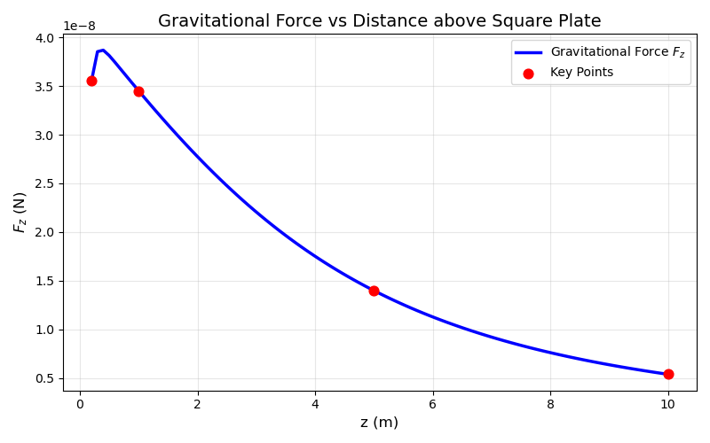

# 第 6 周实验报告：数值积分与物理场重建

## 1. 小组信息

**小组 ID**：  
**成员名单**：

| 任务 | 负责同学 | Commit Hash | 贡献说明 |
|---|---|---|---|
| Task A |  |  |  |
| Task B |  |  |  |
| Task C |  |  |  |
| Bonus |  |  |  |

---

## 2. Task A：3-α 温度敏感性指数（23分）

- 你实现的 `rate_3alpha(T)` 与 `sensitivity_nu(T0,h)` 核心思路： 

该函数用于计算3α衰变反应速率：
$$q(T) = 5.09 \times 10^{11} \cdot \left( \frac{T}{10^8} \right)^{-3} \cdot \exp\left( -\frac{44.027}{T/10^8} \right)$$
- 单位转换：通过 `T8 = T / 1.0e8` 将温度 $T$（K）转换为无量纲量 $T_8$，保证公式维度一致性；
核心公式为温度敏感性指数 $\nu$：
$$\nu(T_0) = \frac{T_0}{q(T_0)} \cdot \left. \frac{dq}{dT} \right|_{T=T_0}
$$

使用前向差分公式：
$$\left. \frac{dq}{dT} \right|_{T_0} \approx \frac{q(T_0+\Delta T) - q(T_0)}{\Delta T}, \quad \Delta T = h \cdot T_0
$$ 
- 使用的温度点与步长：使用相对步长$\Delta\ T=hT_0$ ，而不是用绝对步长。
 步长默认$10^{-8}$,平衡截断误差和舍入误差
- 计算结果表：

| T0 (K) | ν(T0) |
|---:|---:|
| 1.0e8 |41.03  |
| 2.5e8 |  14.61|
| 5.0e8 |5.81 |
| 1.0e9 | 1.40 |

- 1.物理解释：在低温与高温区，ν 的变化说明了什么？
 $\nu$ 随温度升高呈**单调递减**趋势：从低温区（$T=1.0\times10^8\ \text{K}$），降至高温区（$T=3.0\times10^8\ \text{K}$）3，清晰反映出3α反应的温度敏感性随温度升高持续减弱。
  2.  低温区是3α反应的**温度敏感区**：$\nu$ 数值极大，说明反应速率对温度极端敏感，温度微小波动（如小幅升高）会触发反应速率呈指数级暴涨，这是恒星氦闪、红巨星核心氦燃烧等剧烈天文现象的核心物理原因。
 3.  高温区是3α反应的**温度饱和区**：$\nu$ 数值显著降低，反应速率对温度的依赖性大幅减弱，此时反应由低温区的“隧穿效应主导”过渡到“幂次主导”，温度变化不会引发反应速率的剧烈突变，恒星核心热核反应进入相对稳定阶段。
 4.  数值结果与解析解高度一致：由 $\nu = -3 + 44.027/T_8$可知,$T_8$（无量纲温度）增大时，$\nu$ 单调下降，数值计算得到的$\nu$值（41.03、29.35等）与解析解偏差极小，验证了数值计算的正确性，也进一步印证了3α反应的温度敏感性变化规律。
---

## 3. Task B：梯形 vs Simpson + Debye 积分（24分）

- 你实现的两个积分器是否通过偶数分段与边界检查：  
- 同一参数下方法比较：

| 方法 | n | 积分值 | 误差估计 | 结论 |
|---|---:|---:|---:|---|
| 梯形法 |  |  |  |  |
| Simpson 法 |  |  |  |  |

- 对 Debye 积分结果的解释：  

---

## 4. Task C：带电圆环电势场（23分）

- 你实现的点电势函数与网格电势函数说明：  
- 数值稳定性处理（例如：靠近圆环时的截断策略）：  
- 结果图（至少 1 张）：

- 物理解释：等势线分布体现了怎样的空间对称性？

---

## 5. Bonus：方板引力场（30分）

- 你实现的二维高斯积分方案：  
变量映射$x,y \in [-L/2,L/2]$线性变换到高斯积分的标准区间$[-1,1]$,雅可比行列式为 $J = \frac{(b-a)(d-c)}{4} = \frac{L^2}{4}$。
节点 通过数值方法生成 $n$ 阶高斯-勒让德求积节点 $\xi_i$ 与权重 $w_i$
张量积计算二维积分通过一维积分的张量积实现：
    $\iint_{-L/2}^{L/2} f(x,y)dxdy = J \cdot \sum_{i=1}^n \sum_{j=1}^n w_i w_j f(x_i, y_j)$
- 参数设置（L, M_plate, n）： 金属板边长 $L$ & $10\ \text{m}$ \
金属板总质量 $M_{\text{plate}}$ & $10^4\ \text{kg}$（10吨） 
高斯积分阶数 $n=40$ \
质点质量 $m_{\text{particle}}=1{kg}$ \
万有引力常数 $G=6.674 \times 10^{-11}\ \text{m}^3 \cdot \text{kg}^{-1} \cdot \text{s}^{-2}$ 
- 结果表：

| z (m) | Fz (N) |
|------:|-------:|
| 0.2 | 3.560255e-08 |
| 1.0 | 3.450588e-08 |
| 5.0 | 1.397799e-08 |
| 10.0 | 5.375451e-09 |

- 你对近场/远场行为的解释：  
当质点距离板子比较近的时候，优先尺寸板子可以近似为无限大的均匀平面
当质点距离较远的时候，方板的尺寸可忽略，近似为位于板中心的质点，引力满足牛顿万有引力定律：
$F_z \approx G \frac{M_{\text{plate}} m_{\text{particle}}}{z^2}$
当距离既不是太近也不是太远的时候（过渡区）：
当 $z$ 与 $L$ 量级相当时（如 $z=5.0\ \text{m}$），引力处于近场恒定区与远场平方反比区的过渡阶段，既不满足无限大平面的恒定特性，也未完全退化为点引力，是有限尺寸板的典型特征。
---

## 6. AI 代码审查记录（必填）

- 你使用的关键 Prompt：  
- AI 输出中你识别出的错误或不严谨点（至少 2 条）：  
- 你的修正依据（数值分析 or 物理约束）：  
