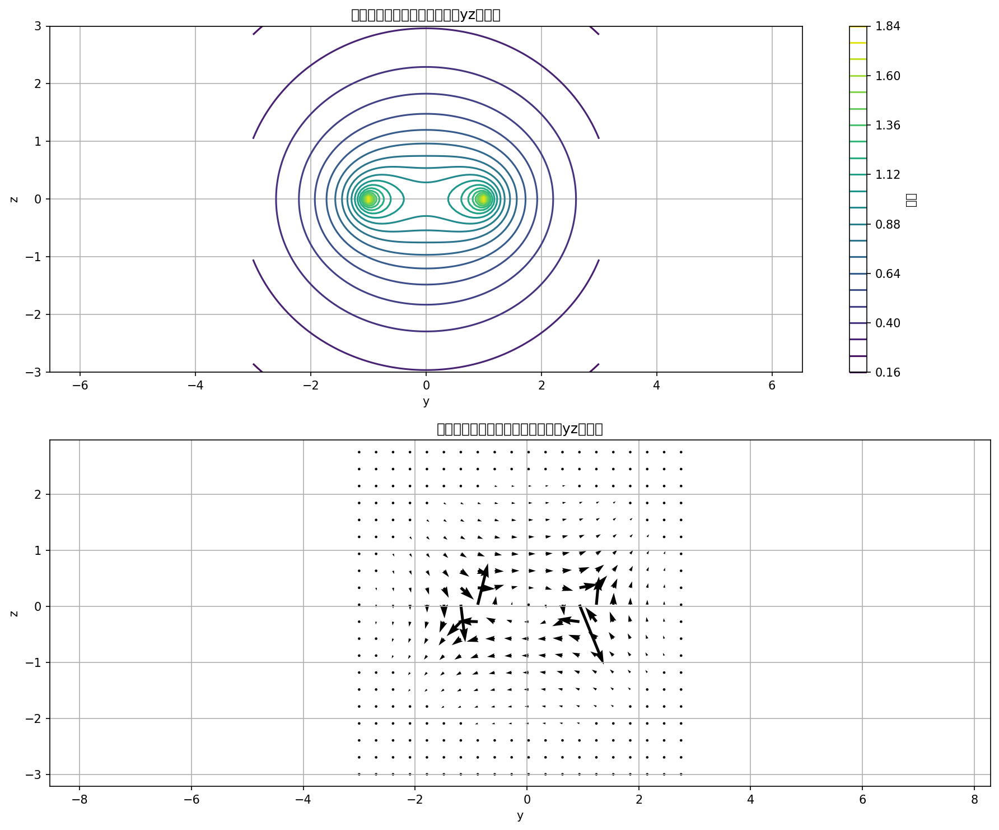

# 第 6 周实验报告：数值积分与物理场重建

## 1. 小组信息

**小组 ID**：  
**成员名单**：

| 任务 | 负责同学 | Commit Hash | 贡献说明 |
|---|---|---|---|
| Task A |  |  |  |
| Task B |  |  |  |
| Task C |  |  |  |
| Bonus |  |  |  |

---

## 2. Task A：3-α 温度敏感性指数（23分）

- 你实现的 `rate_3alpha(T)` 与 `sensitivity_nu(T0,h)` 核心思路：  
- 使用的温度点与步长：  
- 计算结果表：

| T0 (K) | ν(T0) |
|---:|---:|
| 1.0e8 |  |
| 2.5e8 |  |
| 5.0e8 |  |
| 1.0e9 |  |

- 物理解释：在低温与高温区，ν 的变化说明了什么？

---

## 3. Task B：梯形 vs Simpson + Debye 积分（24分）

- 你实现的两个积分器是否通过偶数分段与边界检查：  
- 同一参数下方法比较：

| 方法 | n | 积分值 | 误差估计 | 结论 |
|---|---:|---:|---:|---|
| 梯形法 |  |  |  |  |
| Simpson 法 |  |  |  |  |

- 对 Debye 积分结果的解释：  

---

## 4. Task C：带电圆环电势场（23分）

- 你实现的点电势函数与网格电势函数说明：  1.使用离散积分计算单点电势，通过对角度 φ 进行积分，计算每个电荷元在空间点产生的电势并求和。
2.在 yz 网格上计算电势矩阵，使用 NumPy 向量化操作提高计算效率。
3.基于电势梯度计算电场分量，使用 np.gradient 函数计算电势在 y 和 z 方向的梯度，然后取负值得到电场。
- 数值稳定性处理（例如：靠近圆环时的截断策略）：  在计算距离时添加了小量 ε（1e-10），避免在靠近圆环时出现除零错误。
- 结果图（至少 1 张）：

- 物理解释：等势线分布体现了怎样的空间对称性？
1. 等势线分布体现了圆环的轴对称性，等势线在 yz 平面上呈现出以原点为中心的圆形对称分布。
2. 电场矢量指向电势降低最快的方向，在圆环中心附近，电场方向沿径向；在远离圆环的区域，电场近似为点电荷的电场分布。
---

## 5. Bonus：方板引力场（30分）

- 你实现的二维高斯积分方案：  
- 参数设置（L, M_plate, n）：  
- 结果表：

| z (m) | Fz (N) |
|---:|---:|
| 0.2 |  |
| 1.0 |  |
| 5.0 |  |
| 10.0 |  |

- 你对近场/远场行为的解释：  

---

## 6. AI 代码审查记录（必填）

- 你使用的关键 Prompt：  
- AI 输出中你识别出的错误或不严谨点（至少 2 条）：  
- 你的修正依据（数值分析 or 物理约束）：  
